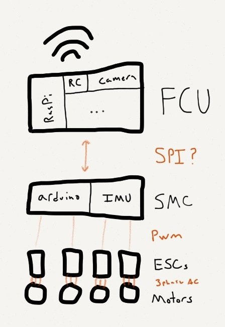
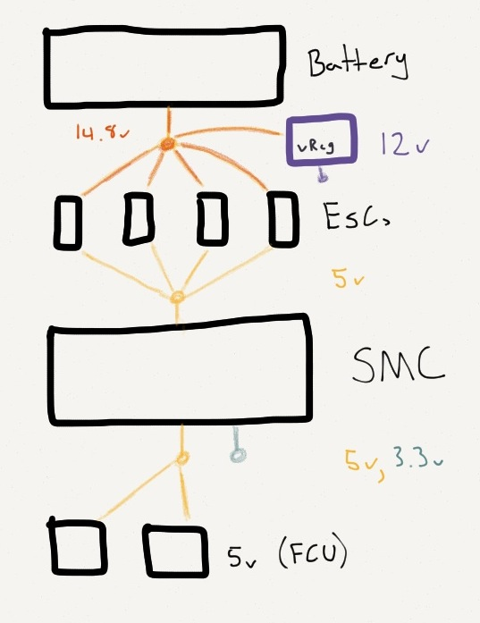

# Quadrocopter Documentation

Discoveries and details will be explained and referenced here. The parts in this
documents are based on the build we are making. More information available on
[Trello](https://trello.com/b/EygHwZfX). For reference here are a collection of
[useful links](links.md).

## Overview

The overall design of the quadcopter is laid out below, this will not get into
the inner workings of any individual [components](#components).

### Control

At a high level this is the design of the project. Using two distinct units for
controlling the quadrocopter will allow a far more dynamic interface to control
it with. We can program the logic on top of a Raspberry Pi running Ruby, or
other high level languages.

### Power

Powering the quadrocopter is 1 3000 mAh LiPo battery. It's a 4 cell battery
@ 14.8 V. The following diagram shows how the system is powered.

## Components

Here lies the details of the individual components of the system.

### Ours
 - [SMC (Stable Motor Controller)](components/smc.md)
 - [FCU (Flight Control Unit)](components/fcu.md)

### Vendor
 - [ESCs](components/esc.md)
 - [Battery](components/battery.md)
