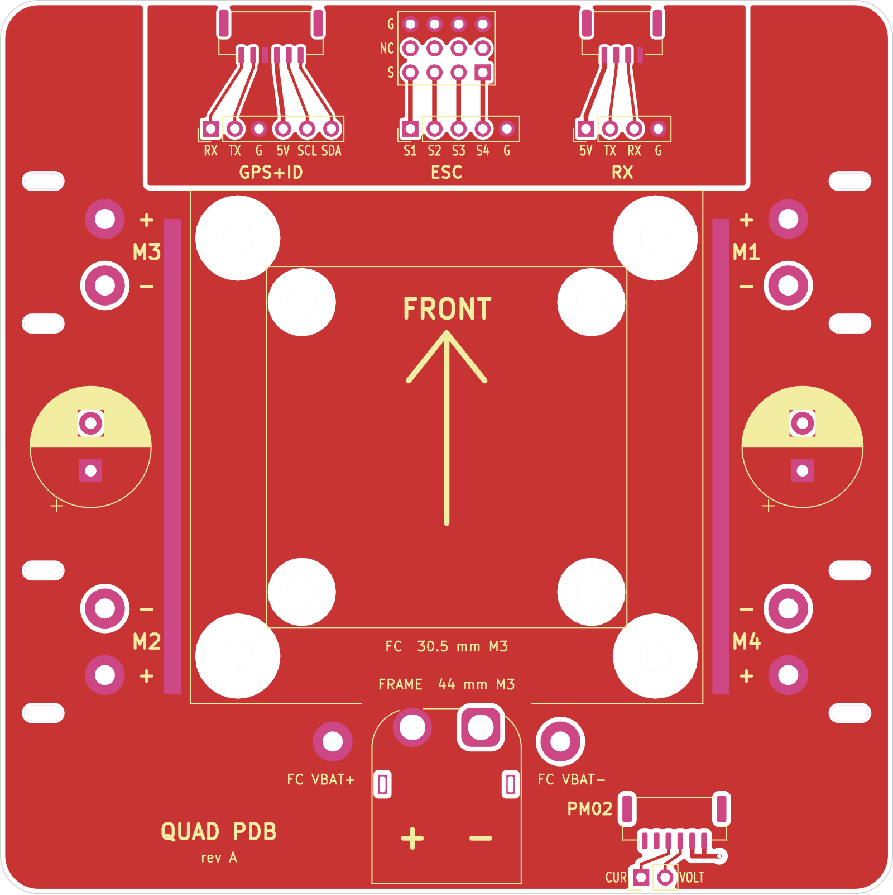
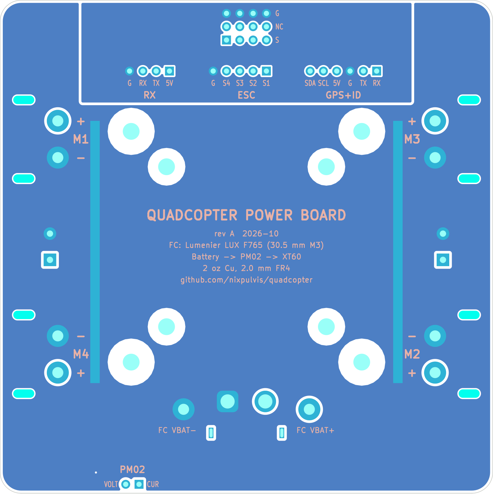

# FC adapter / power board (rev A)

A 94 × 94 mm, 2-layer, 2 oz copper, 2.0 mm FR4 board that bolts rigidly to the
frame's nylon standoffs. It carries the battery connector, the 4-way ESC power
bus, the ESC signal header, and plug-in ports for the receiver, GPS + Remote ID and PM02. It holds the Lumenier LUX F765 NDAA flight controller
(38 × 38 mm, 30.5 mm M3) on standoffs with rubber grommets.

```
  [      FC       ]   <- floats on 4x M3 rubber grommets
     |  |  |  |       <- M3 standoffs, ~10 mm, 30.5 mm square
  [  this board   ]   <- bolted rigidly to the frame standoffs
  [  frame plate  ]
```

| Top | Bottom (mirrored, as seen from below) |
|---|---|
|  |  |

Schematic: [docs/schematic.svg](docs/schematic.svg).
DRC: [docs/drc.rpt](docs/drc.rpt). Schematic/board net check: [docs/netlist-check.txt](docs/netlist-check.txt).

Rev A is the first board to be fabricated. Earlier unbuilt drafts targeted the
Matek H743-WING V3 and the CoreWing F405 WING V2, which both sold out. The LUX
has no power board or current sensor, so a Holybro PM02 sits between the
battery and this board.

## Power path

```
battery -> Holybro PM02 (current + voltage sense, cable to J9) -> J1 XT60
J1 -> ESC bus pours -> M1..M4 ESC pads
                    -> P1/P2 "FC VBAT" -> FC battery pads
```

Every power pad has a + or - mark beside it.

* **VBAT_ESC** is a near full-board pour on the top layer and **GND_ESC** on the
  bottom. Exposed copper strips beside the FC area can be loaded with solder.
* The PM02 measures all the current, motors and electronics alike, because
  everything downstream of it runs through this board.
* Signal ground (the front strip) only meets GND_ESC through the FC.
* C1 and C2 (1000 µF 35 V low-ESR each) sit across the ESC bus, one on each
  side, so the board stays balanced.
* Power pads connect solidly to the pours (no thermal reliefs), so use a big
  iron for the XT60 and wire pads.

## Signals and ports

| Ref | What | Pins |
|---|---|---|
| J2 | ESC servo plugs, 3 × 4 | rows S (signal), NC (ESC BEC 5V, not connected), G; columns S1–S4 |
| J3 | FC LINK | S1, S2, S3, S4, G |
| J5 / J6 | GPS+ID socket (JST-GH 6) / its FC lead pads | RX, TX, G, 5V, SCL, SDA |
| J7 / J8 | RX (receiver) socket (JST-GH 4) / its FC lead pads | 5V, TX, RX, G |
| J9 / J10 | PM02 socket (JST-GH 6) / its FC lead pads | socket: VCC, VCC (both NC), CUR, VOLT, G, G; pads: CUR, VOLT |

The ESC plugs fit unmodified: their red wire lands on the NC row, so the four
ESC BECs never feed the FC. J3 takes a short 5-wire lead to the FC's S1–S4 and
G pads.

The LUX has only solder pads, so every device plugs into this board instead.
Each port has a row of pads for a short lead soldered once to the FC, and a
JST-GH socket for the device:

* **GPS+ID (J5/J6)** is for the BeeID Pro M10, which does GPS, compass and Remote ID from one plug. The socket follows the BeeID Pro's
  listed order (ReadyMadeRC: TX, RX, GND, 5V, SCL, SDA, from the module's
  side), so the module's stock GH cable plugs straight in; the FC lead pads are
  labelled from the FC side (RX, TX, G, 5V, SCL, SDA). Wire J6 to one FC UART
  group plus SDA/SCL (the LUX has GND, 5V, RX3, TX3, SDA, SCL side by side).
  Check the pads printed on the module against this when it arrives.
* **RX (J7/J8)** is for the ELRS receiver. Wire J8 to another UART group (the
  LUX has TX8, RX8, 5V, GND together). The receiver's lead needs a JST-GH
  plug with its RX on the TX pin and its TX on the RX pin.
* **PM02 (J9/J10)**, at the rear by the XT60, takes the PM02's sense cable.
  Its 5V is left unconnected because the LUX has its own BEC, and its ground
  is the battery negative, which is already this board's ESC bus. So J10 only
  needs two wires: CUR to the FC's Curr pad, and optionally VOLT (the FC
  already reads the battery voltage on its VBAT pads).

The front ports all read the same way, front edge to back: the device's
connector, the pad row for the lead to the FC, the pin names, then the port's
name. The ESC header is turned so its G row is at the edge and its S row
faces the FC link.

TX and RX are named from the FC's side everywhere. Keep the receiver itself
on its lead, away from the copper pours, with the antenna out in the open.

Remote ID comes from the BeeID Pro M10 on the GPS+ID socket. NewBeeDrone's
FAA declaration RID000001995 (model "BeeID", accepted) covers serials
2071F000000000000000 to 2071FZZZZZZZZZZZZZZZ, so check the module's serial
starts with 2071F.

ArduPilot (target `LumenierLUXF765-NDAA`): motors are outputs 1–4
(`SERVOn_FUNCTION` 33–36), so J3 S1–S4 go to the FC's S1–S4.

Motor numbering follows ArduPilot Quad X: M1 front-right, M2 rear-left,
M3 front-left, M4 rear-right. Each ESC pad pair has two zip-tie slots for
strain relief.

## Still to confirm

* **Which LUX UARTs** go to J6 and J8. The silkscreen groups are read off
  photos; check them against the `LumenierLUXF765-NDAA` hwdef and set
  `SERIALn_PROTOCOL` (5 for GPS, 23 for RC) and `BATT_CURR_PIN` to match.
* **Frame standoffs** are 44 × 44 mm centre to centre, M3 (measured). They
  sit just outside the FC's corners, so the frame screw heads end up under
  the FC, which clears them on its ~10 mm standoffs. The nuts or screw ends
  of the FC standoffs hang under this board, so the frame standoffs must be
  taller than those.
* **Nothing taller than about 4 mm goes under the FC.** It sits about
  10 mm up on grommets and has parts on its underside, so the 54 mm square
  under it is kept for low parts only (it's empty).
* The XT60 is rated about 30 A continuous / 60 A burst. That covers hover and
  normal flight; `MOT_BAT_CURR_MAX ≈ 70` limits the peaks.

## Working on it

The KiCad files are the source of truth once you start editing in KiCad
(7.0 or newer). The scripts bootstrapped the board and are handy while the
mechanical numbers are still moving, but `generate.py` overwrites both files:

```sh
python3 scripts/generate.py   # schematic, placement, pours, the four S tracks
python3 scripts/check.py      # fill pours, DRC + schematic/board net check
scripts/export.sh             # renders (docs/) and Gerbers (fab/)
```

Use the Python that ships with KiCad (`python3.12` on Ubuntu 24.04's KiCad 7).
`scripts/route.py` (Freerouting) is only needed if signal nets come back that
`generate.py` doesn't route itself. `export.sh` writes `fab/fc-adapter-gerbers.zip` for JLCPCB
(choose 2 oz outer copper and 2.0 mm thickness when ordering).

### Ordering with assembly (JLCPCB)

`export.sh` also writes `fab/jlcpcb-bom.csv` and `fab/jlcpcb-cpl.csv`. Upload
them with the Gerber zip and pick PCB Assembly. They list only the parts
JLCPCB fits: the XT60 (J1), C1 and the three GH sockets (J5, J7, J9). The rest
(the ESC and FC LINK headers, wire pads and the FC lead pad rows) is soldered
by hand. Those parts are marked with `MPN`, `LCSC` and `JLCPCB` fields, which
are set in `ASSEMBLY` in `scripts/generate.py`.

* No LCSC numbers are filled in yet. JLCPCB's order page matches the part
  number and lets you pick a stocked part.
* Check every part's rotation in JLCPCB's placement preview before paying.

Project-local parts live in `lib/` (`fc-adapter.pretty`, `fc-adapter.kicad_sym`):
wire pads for 12/14AWG leads, the 3 × 4 ESC header and the zip-tie slot.
Everything else comes from KiCad's standard libraries.

KiCad 7's command line has no ERC, so `check.py` compares every pin's net in
the schematic netlist against the matching pad on the board instead.
